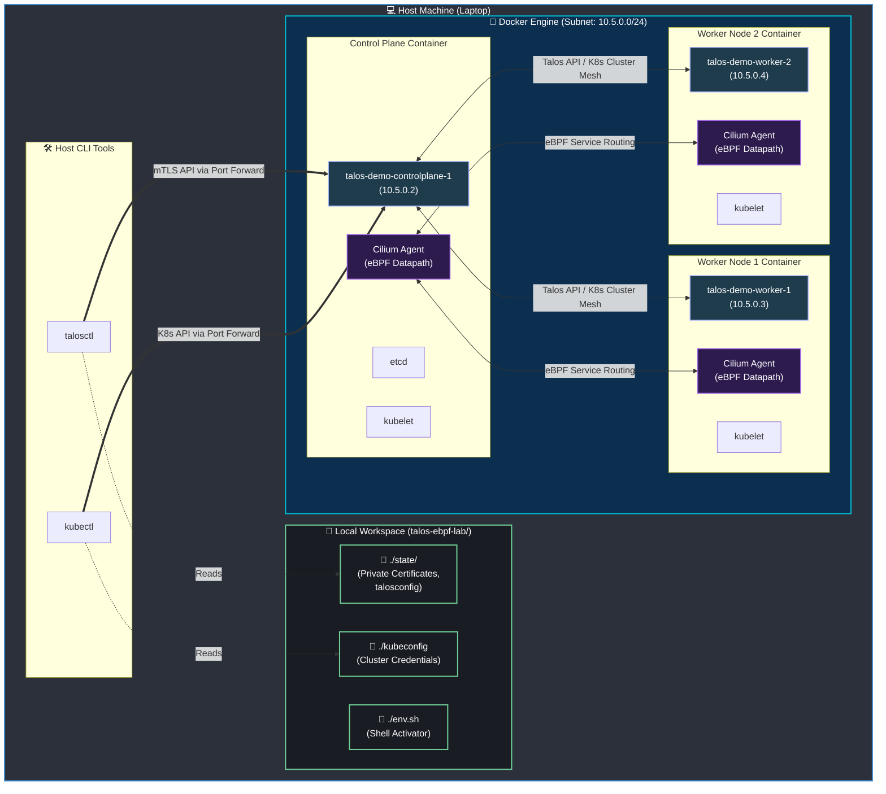

# talos-ebpf-lab: Local Talos Kubernetes Cluster with Cilium CNI (eBPF Kube-Proxy Replacement)

A lightweight, rootless, containerized Kubernetes PoC demo cluster designed specifically to run locally on your **laptop and/or workstation** without heavy hypervisors or host environment pollution. It runs **Talos Linux (v1.13.2)**, **Kubernetes (v1.36.0)**, and **Cilium CNI (v1.19.4)** in strict eBPF `kube-proxy` replacement mode.

This project is optimized for developers and network engineers wanting to spin up a rapid, isolated development sandbox for testing modern eBPF networking directly on their personal computers or office workstations.

## 📐 Architecture Overview



---

## ⚡ Core Features

* **100% Host-Isolated**: Zero interference with other local or global Kubernetes and Talos configurations. It writes states, keys, and tokens directly inside this workspace directory, leaving your `~/.kube/config` and `~/.talos/config` pristine.
* **Rootless & Fast Deployment**: Boots the nodes as containerized processes using `talosctl cluster create docker`, bypassing virtual machines or root (`sudo`) privilege requirements.
* **Strict Kube-Proxy Replacement**: Kubernetes services are load-balanced directly inside the Linux host kernels by Cilium eBPF maps instead of legacy `iptables` or `ipvs` rules.
* **Observability Out-of-the-Box**: Hubble Relay is pre-configured so you can observe live packet flows and connection drops directly inside your terminal.

---

## 📂 Project Structure

```
├── bootstrap.sh                        # Wipes old state, boots Docker nodes, templates IPs, and installs Cilium
├── teardown.sh                         # Destroys all cluster containers, networks, and cleans local state
├── USAGE.md                            # Comprehensive operations manual & beginner cheat sheet (talosctl, cilium, kubectl)
├── cilium-values.yaml                  # Template Helm values for strict kube-proxy replacement and Hubble
├── talosconfig-patch-controlplane.yaml # Talos control plane patch (CNI: none, custom Pod/Service CIDRs, no kube-proxy)
├── talosconfig-patch-worker.yaml       # Talos worker node patch (disabled kube-proxy)
├── .gitignore                          # Confines cluster credentials, tokens, and active files to your local folder
└── state/                              # [Generated] Private directory for keys, talosconfig, and internal Talos state
```

---

## 🛠️ Prerequisites

Before executing the bootstrap script, make sure your host machine has the following tools installed and configured:

### 1. Host Requirements
* **Operating System**: Linux (Ubuntu, Debian, Fedora, Arch, etc.) or macOS with Docker Desktop.
* **Docker Engine** (or Docker Desktop): Used to spin up the containerized Talos nodes.
  > [!IMPORTANT]
  > **Docker Group Membership**: Your host user account must belong to the `docker` group so that you can run Docker commands without prefixing them with `sudo`.
  > Verify this by running `docker ps` in your terminal. If it returns an error or permission denied, add yourself using:
  > ```bash
  > sudo usermod -aG docker $USER && newgrp docker
  > ```

### 2. Quick CLI Installation Guides

Select the quick install command block for your operating system to install **`talosctl`**, **`kubectl`**, **`helm`**, **`cilium`**, and **`hubble`** all in one go:

#### 🍎 macOS (via Homebrew)
If you are running on macOS, install all required and optional binaries in a single line:
```bash
brew install siderolabs/tap/talosctl kubernetes-cli helm cilium-cli hubble
```

#### 🐧 Linux (Ubuntu / Debian / Linux Mint)
Copy and paste this unified block to fetch, verify, and install all five CLI binaries automatically:
```bash
# 1. Update and install base utilities
sudo apt-get update && sudo apt-get install -y curl apt-transport-https ca-certificates gnupg

# 2. Install kubectl
sudo mkdir -p -m 755 /etc/apt/keyrings
curl -fsSL https://pkgs.k8s.io/core:/stable:/v1.36/deb/Release.key | sudo gpg --dearmor -o /etc/apt/keyrings/kubernetes-apt-keyring.gpg
echo 'deb [signed-by=/etc/apt/keyrings/kubernetes-apt-keyring.gpg] https://pkgs.k8s.io/core:/stable:/v1.36/deb/ /' | sudo tee /etc/apt/sources.list.d/kubernetes.list
sudo apt-get update && sudo apt-get install -y kubectl

# 3. Install talosctl
curl -sL https://talos.dev/install | sudo sh

# 4. Install Helm 3
curl -fsSL https://raw.githubusercontent.com/helm/helm/main/scripts/get-helm-3 | bash

# 5. Install Cilium CLI
CILIUM_CLI_VERSION=$(curl -s https://raw.githubusercontent.com/cilium/cilium-cli/main/stable.txt)
curl -L --fail --remote-name-all https://github.com/cilium/cilium-cli/releases/download/${CILIUM_CLI_VERSION}/cilium-linux-amd64.tar.gz
sudo tar -C /usr/local/bin -xzvf cilium-linux-amd64.tar.gz && rm cilium-linux-amd64.tar.gz

# 6. Install Hubble CLI
HUBBLE_VERSION=$(curl -s https://raw.githubusercontent.com/cilium/hubble/main/stable.txt)
curl -L --fail --remote-name-all https://github.com/cilium/hubble/releases/download/${HUBBLE_VERSION}/hubble-linux-amd64.tar.gz
sudo tar -C /usr/local/bin -xzvf hubble-linux-amd64.tar.gz && rm hubble-linux-amd64.tar.gz
```

#### 🎩 Linux (Fedora / RHEL / CentOS)
Copy and paste this block for RPM-based Linux systems:
```bash
# 1. Install kubectl
cat <<EOF | sudo tee /etc/yum.repos.d/kubernetes.repo
[kubernetes]
name=Kubernetes
baseurl=https://pkgs.k8s.io/core:/stable:/v1.36/rpm/
enabled=1
gpgcheck=1
gpgkey=https://pkgs.k8s.io/core:/stable:/v1.36/rpm/repodata/repomd.xml.key
EOF
sudo dnf install -y kubectl

# 2. Install talosctl
curl -sL https://talos.dev/install | sudo sh

# 3. Install Helm 3
curl -fsSL https://raw.githubusercontent.com/helm/helm/main/scripts/get-helm-3 | bash

# 4. Install Cilium & Hubble CLIs
CILIUM_CLI_VERSION=$(curl -s https://raw.githubusercontent.com/cilium/cilium-cli/main/stable.txt)
curl -L --fail --remote-name-all https://github.com/cilium/cilium-cli/releases/download/${CILIUM_CLI_VERSION}/cilium-linux-amd64.tar.gz
sudo tar -C /usr/local/bin -xzvf cilium-linux-amd64.tar.gz && rm cilium-linux-amd64.tar.gz

HUBBLE_VERSION=$(curl -s https://raw.githubusercontent.com/cilium/hubble/main/stable.txt)
curl -L --fail --remote-name-all https://github.com/cilium/hubble/releases/download/${HUBBLE_VERSION}/hubble-linux-amd64.tar.gz
sudo tar -C /usr/local/bin -xzvf hubble-linux-amd64.tar.gz && rm hubble-linux-amd64.tar.gz
```

> [!NOTE]
> **No Pre-configured Helm Repositories Required**:
> The `bootstrap.sh` script automatically handles adding and updating the Cilium Helm repository (`https://helm.cilium.io/`) during the execution, so you do not need to add it manually beforehand.

---

## 🚀 Quick Start


### 1. Launch the Cluster
Execute the bootstrap script to dynamically resolve IPs, configure configs, and install the CNI:
```bash
./bootstrap.sh
```

### 2. Activate the Environment (Current Terminal Shell)
To route `kubectl` and `talosctl` commands directly to this isolated local sandbox:
```bash
source env.sh
```

### 3. Verify Health
```bash
# Check operating system health across all nodes (controlplane + workers)
talosctl health --control-plane-nodes 10.5.0.2 --worker-nodes 10.5.0.3,10.5.0.4

# Check Kubernetes node statuses
kubectl get nodes -o wide

# Check CNI & eBPF load-balancer status
kubectl -n kube-system exec -it ds/cilium -- cilium status
```

> [!TIP]
> **Why does bare `talosctl health` show "unexpected nodes"?**
> By default, `talosconfig` is configured to target only the controlplane node (`10.5.0.2`) for host-level commands. Running bare `talosctl health` only monitors the controlplane node. When it queries Kubernetes and detects the worker nodes (`10.5.0.3` and `10.5.0.4`) running, it flags them as "unexpected" because it doesn't have them in its target list. Specifying `--control-plane-nodes` and `--worker-nodes` explicitly directs `talosctl` to monitor and verify all nodes successfully.

---

## 🌐 Custom Subnet Configuration

By default, the cluster network runs on the **`10.5.0.0/24`** subnet. If this clashes with your local network, corporate VPN, or host routing configurations, you can easily change the subnet to any custom CIDR block (e.g., `172.20.0.0/24`):

### How to use a custom subnet:
1. Open `bootstrap.sh` and append the `--subnet` flag to the `talosctl cluster create docker` command:
   ```bash
   talosctl cluster create docker \
     --name "${CLUSTER_NAME}" \
     --workers 2 \
     --kubernetes-version "${KUBERNETES_VERSION}" \
     --config-patch-controlplanes @talosconfig-patch-controlplane.yaml \
     --config-patch-workers @talosconfig-patch-worker.yaml \
     --state "$(pwd)/state" \
     --talosconfig-destination "${TALOSCONFIG}" \
     --subnet "172.20.0.0/24"  # <-- Add your custom CIDR here
   ```
2. Run the bootstrap script:
   ```bash
   ./bootstrap.sh
   ```

> [!NOTE]
> **Fully Dynamic Automation**:
> You do **not** need to modify any other configuration files! The `bootstrap.sh` script automatically handles the rest:
> * Queries the Docker network to discover the newly assigned controlplane IP.
> * Generates and substitutes the new IP into your active Helm values (`cilium-values-active.yaml`).
> * Configures your local targeted context in `state/talosconfig`.
> * *Note: Remember to update your manual `talosctl health` node IP arguments to match your new IPs!*

---

## 🏷️ Custom Cluster Naming

By default, the cluster is named **`talos-demo`**. If you want to use a different name for your environment:

### How to use a custom cluster name:
1. Open **[bootstrap.sh](bootstrap.sh)** and change the `CLUSTER_NAME` variable at the top:
   ```bash
   CLUSTER_NAME="your-custom-name"
   ```
2. Open **[teardown.sh](teardown.sh)** and change the `CLUSTER_NAME` variable to match the exact same name:
   ```bash
   CLUSTER_NAME="your-custom-name"
   ```
3. Run your new setup as usual:
   ```bash
   ./bootstrap.sh
   ```

> [!IMPORTANT]
> **Keep Names Synced**:
> Make sure both scripts use the exact same `CLUSTER_NAME` value. The teardown script relies on this variable to target and delete the correct Docker containers, networks, and private cryptographic assets inside the workspace.

---

## 📖 In-Depth Operations Guide

For a full list of "nice to know" beginner cheat sheets covering interactive node dashboards, advanced Hubble traffic flow filters, network debugging, and troubleshooting workflows, open the local operations guide:
👉 **[USAGE.md](USAGE.md)**

---

## 🧹 Clean Up
To remove all traces of this cluster, clear the Docker networks, and wipe out credentials from your host:
```bash
./teardown.sh
```
